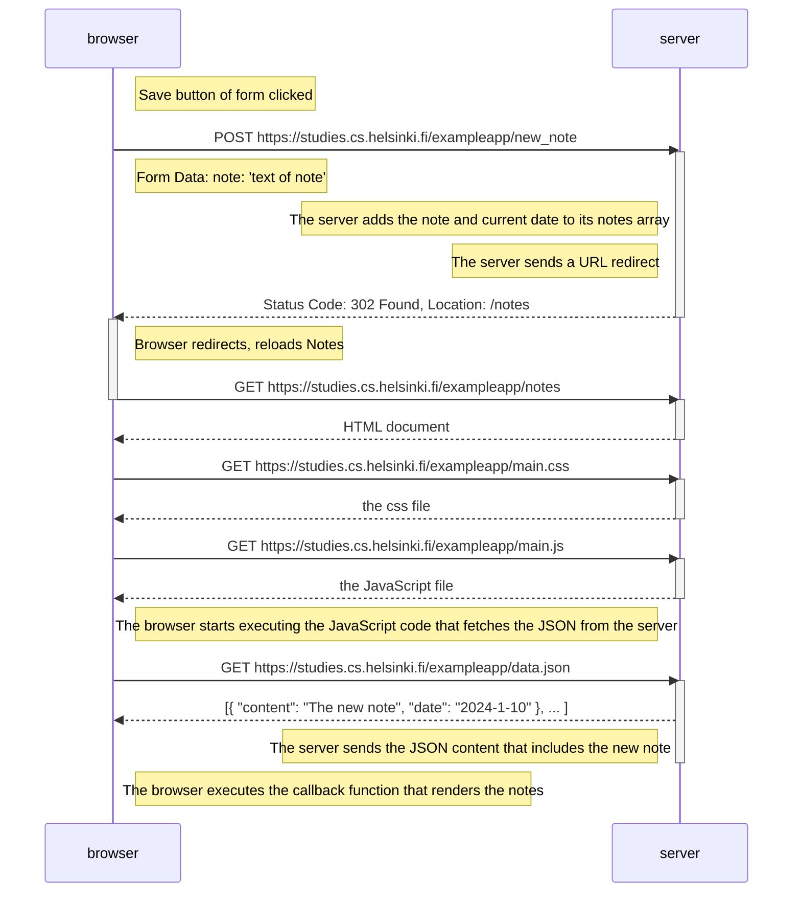

### User creates new note by clicking Save button at https://studies.cs.helsinki.fi/exampleapp/notes

```mermaid
sequenceDiagram
    participant browser
    participant server

    Note right of browser: Save button of form clicked
    browser->>server: POST https://studies.cs.helsinki.fi/exampleapp/new_note
    activate server
    Note right of browser: Form Data: note: 'text of note'

    Note left of server: The server adds the note and current date to its notes array
    Note left of server: The server sends a URL redirect
    server-->>browser: Status Code: 302 Found, Location: /notes
    deactivate server
    
    activate browser
    Note right of browser: Browser redirects, reloads Notes
    browser->>server: GET https://studies.cs.helsinki.fi/exampleapp/notes
    deactivate browser
    activate server
    server-->>browser: HTML document
    deactivate server

    browser->>server: GET https://studies.cs.helsinki.fi/exampleapp/main.css
    activate server
    server-->>browser: the css file
    deactivate server

    browser->>server: GET https://studies.cs.helsinki.fi/exampleapp/main.js
    activate server
    server-->>browser: the JavaScript file
    deactivate server

    Note right of browser: The browser starts executing the JavaScript code that fetches the JSON from the server

    browser->>server: GET https://studies.cs.helsinki.fi/exampleapp/data.json
    activate server
    server-->>browser: [{ "content": "The new note", "date": "2024-1-10" }, ... ]
    Note left of server: The server sends the JSON content that includes the new note
    deactivate server

    Note right of browser: The browser executes the callback function that renders the notes

```

  

    