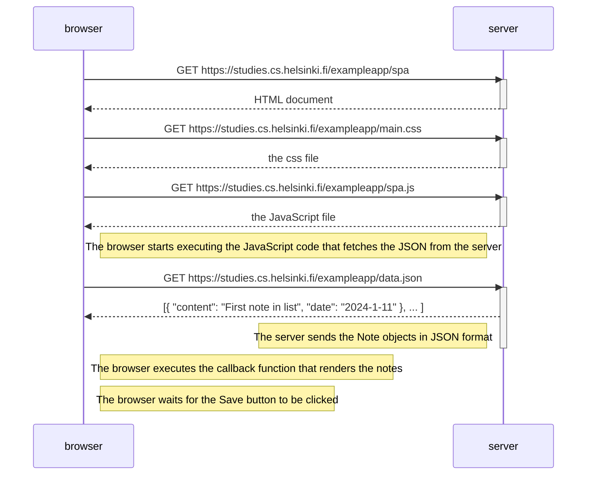

### User goes to single page application version of Notes app at https://studies.cs.helsinki.fi/exampleapp/spa

```mermaid
sequenceDiagram
    participant browser
    participant server

    browser->>server: GET https://studies.cs.helsinki.fi/exampleapp/spa
    activate server
    server-->>browser: HTML document
    deactivate server

    browser->>server: GET https://studies.cs.helsinki.fi/exampleapp/main.css
    activate server
    server-->>browser: the css file
    deactivate server

    browser->>server: GET https://studies.cs.helsinki.fi/exampleapp/spa.js
    activate server
    server-->>browser: the JavaScript file
    deactivate server

    Note right of browser: The browser starts executing the JavaScript code that fetches the JSON from the server

    browser->>server: GET https://studies.cs.helsinki.fi/exampleapp/data.json
    activate server

    server-->>browser: [{ "content": "First note in list", "date": "2024-1-11" }, ... ]
    Note left of server: The server sends the Note objects in JSON format
    deactivate server


    Note right of browser: The browser executes the callback function that renders the notes
    Note right of browser: The browser waits for the Save button to be clicked
```