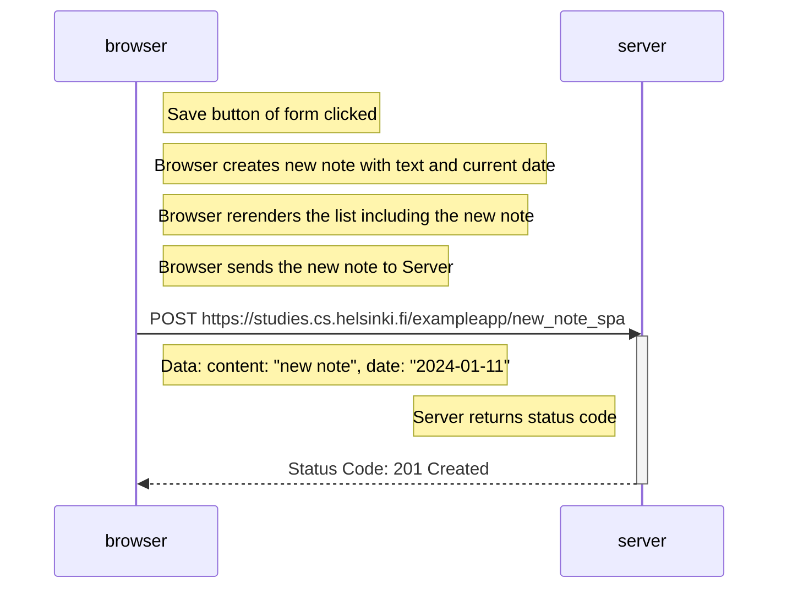

### User creates new note by clicking Save button at the single page application at https://studies.cs.helsinki.fi/exampleapp/spa

```mermaid
sequenceDiagram
    participant browser
    participant server

    Note right of browser: Save button of form clicked
    Note right of browser: Browser creates new note with text and current date
    Note right of browser: Browser rerenders the list including the new note
    Note right of browser: Browser sends the new note to Server
    browser->>server: POST https://studies.cs.helsinki.fi/exampleapp/new_note_spa
    activate server
    Note right of browser: Data: content: "new note", date: "2024-01-11"


    Note left of server: Server returns status code
    server-->>browser: Status Code: 201 Created
    deactivate server
    
```