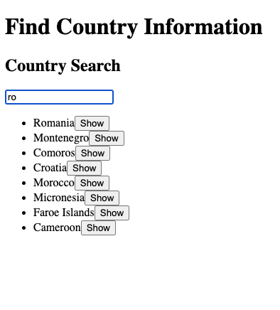
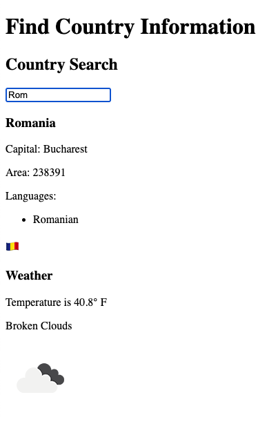

## Full Stack Open Source
### Part 2 - Countries
### Exercises 2.18 - 2.20

*This program searches a REST API for country data.  There is a search field for text to match the name of countries.  Once ten or less countries match the search term, the list of countries is displayed with a Show button that will display basic information for that country.  Once only one country matches the search term, the basic information for that country is displayed.  The capital city of that single country is then used to search a weather api to display current weather in that city.*\

Screenshot for filtered list
 \

Screenshot for single country
 

The country data API is `https://studies.cs.helsinki.fi/restcountries/`\
The weather data API is `https://api.openweathermap.org/`

App.jsx returns the following components
  - Search (the search field for searching countries by name)
  - DisplayFilteredList (the list of ten or fewer countries matching the search term)
  - DisplayCountry (basic country information and weather for the capital city)

To run program\
`export VITE_WEATHER_API_KEY={ your openweathermap api key here } && npm run dev`

