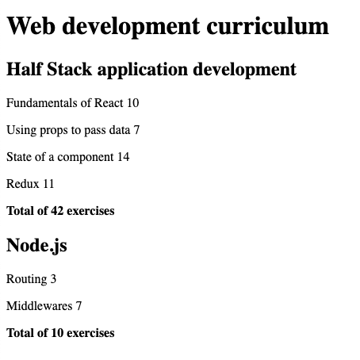

## Full Stack Open Source
### Part 2 - Course Info
### Exercises 2.1 - 2.5

*This program displays course information*\
  

App.jsx contains an array of course information for two courses.\
App.jsx returns the title of the curriculum and the information for two courses.

Components\
Course.jsx contains four smaller components
  - Header (the name of the course)
  - Part (part name and # of exercises for this part)
  - Content (summary component that returns the Parts)
  - Total (total number of exercises for course)

Course.jsx returns the display of a single course, including the title, the parts and number of exercises per each part, and the total number of exercises for the entire course.

To run program
`npm run dev`

